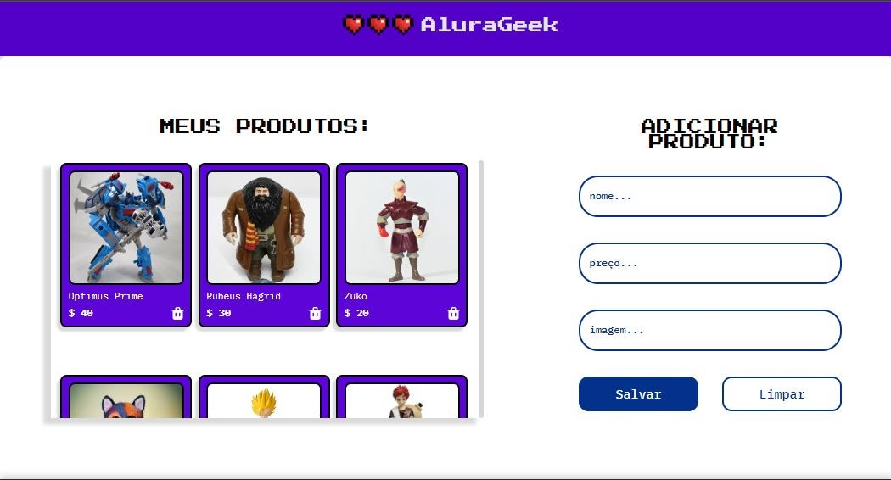

  

<h1>Challenge AluraGeek</h1>

<h2>🔖 Sobre</h2>

Desafio realizado para a conclusão da Formação Front-End do Programa ONE da Oracle + Alura.

## 🚀 Tecnologias

  
  
  
  
  

## 💻 Screenshot

## 🌟 Feito por:

### <a href="https://github.com/ketijor">Keti Jorgensen</a>

